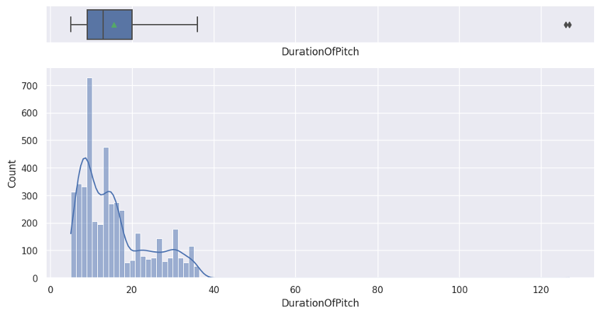
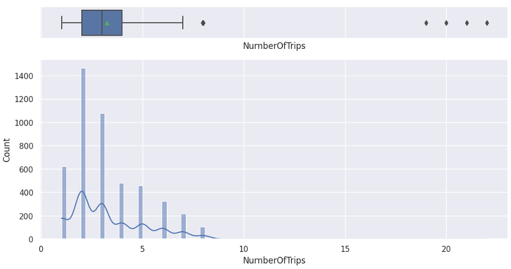
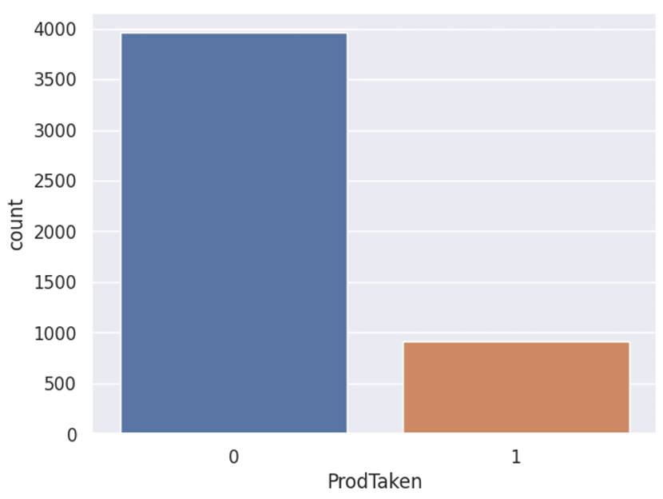
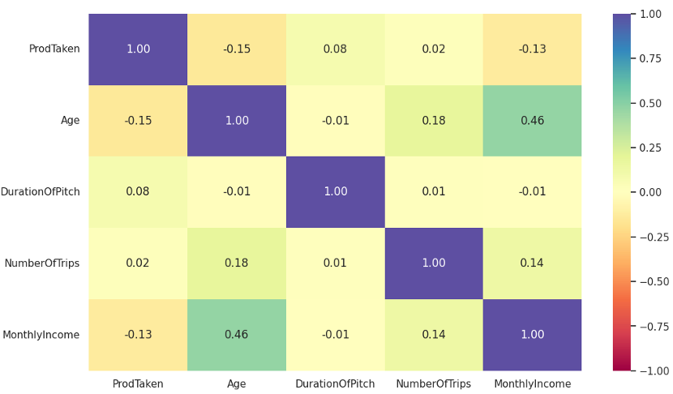
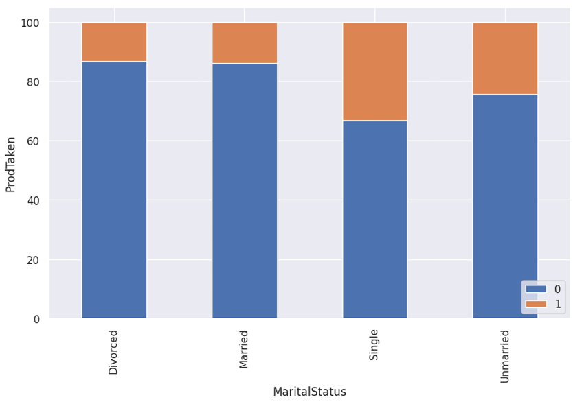
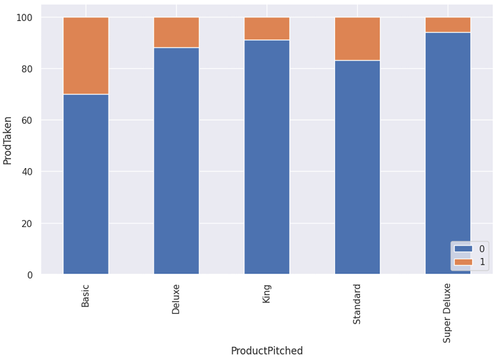
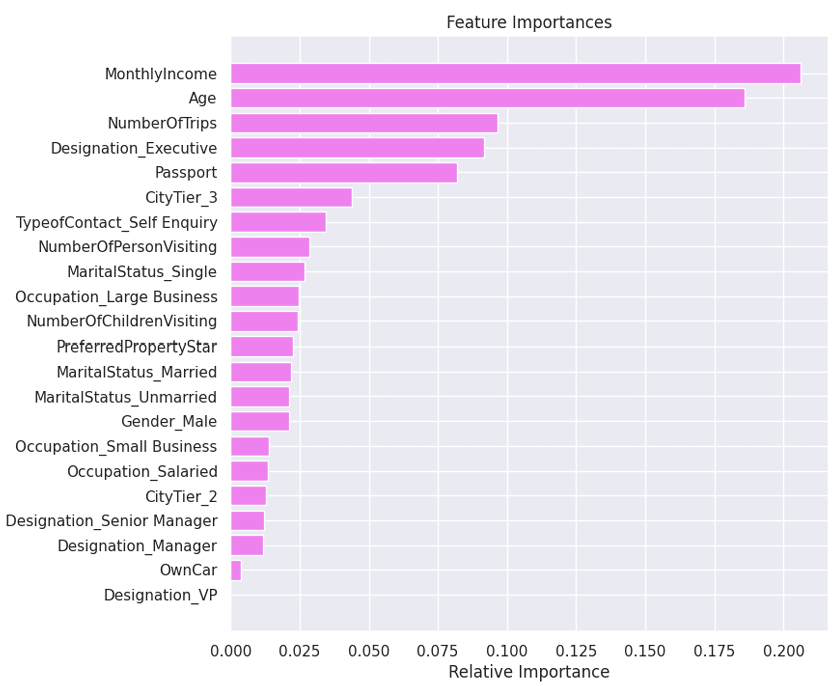
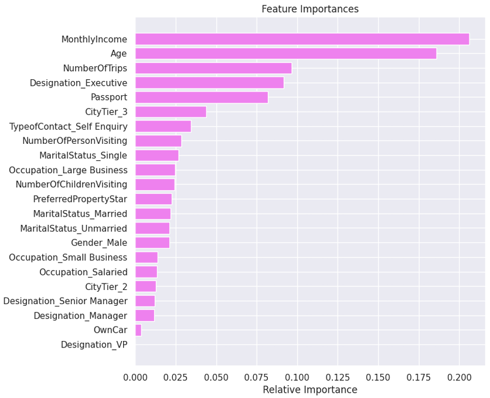
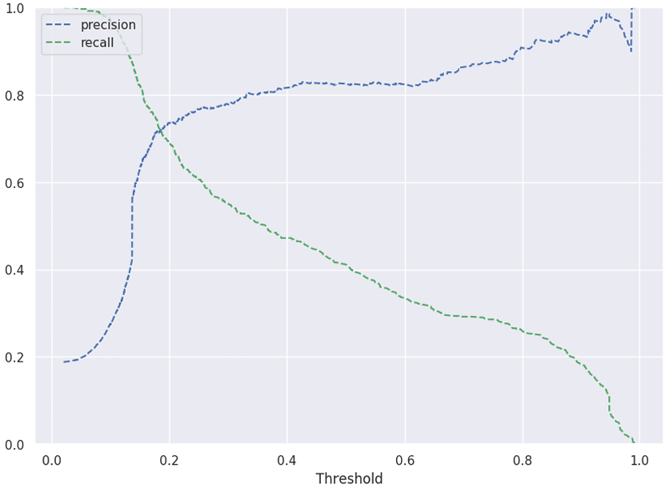

# Business Insights and Model Interpretation

## Executive Summary

This report explores a customer dataset from a tourism company and builds predictive models to identify likely purchasers of a new wellness travel package. Through comprehensive data cleaning, univariate and bivariate EDA, and multiple classification models, I identify the optimal strategy and features to support targeted marketing.

---

## Exploratory Data Analysis

### Age Distribution
The age feature is normally distributed and showed no significant outliers. It is, therefore, a reliable input for modeling.

### Duration of Pitch
Right-skewed with few extreme outliers above 40 minutes. Most pitches are below 20 minutes.

### Monthly Income
Monthly income is right-skewed with several outliers below 12k and above 40k. These were removed during preprocessing.

### Number of Trips
Skewed distribution. Most users travel 2-3 times per year.

### Product Purchase Distribution
Highly imbalanced: ~19% of customers purchased a package.

### Correlation Analysis
Weak positive correlation between age and trips. Monthly income is somewhat predictive. No multicollinearity observed.

---

## Categorical Variables and Target Interaction

### Marital Status vs Purchase
Single/unmarried customers have a higher conversion rate. These segments are promising.

### Product Pitched vs Purchase
Basic and Standard packages convert better than Deluxe or King. Rebalancing pitch strategy is advised.

### Passport vs Purchase
Customers with passports convert significantly more often, suggesting they are valuable targets for international packages.

---

## Model Evaluation and Insights

### Random Forest Feature Importance
Key predictors: `MonthlyIncome`, `Age`, and `NumberOfTrips`. Supports EDA findings.

### Decision Tree Feature Importance
Similar trends as Random Forest. Model is interpretable but overfits slightly.

### SVM-RBF Precision-Recall Curve
Threshold tuning significantly improved recall (~69%). Final model balances precision and recall best.

---

## Conclusion & Business Recommendations

- Focus marketing on single, younger users with passports.

- Tailor package pitch based on income: Basic for lower tiers, King for higher.

- Utilize SVM-RBF for lead prediction, prioritizing recall to maximize engagement.

- Consider future inclusion of behavioral and contextual data (time, seasonal trends).
